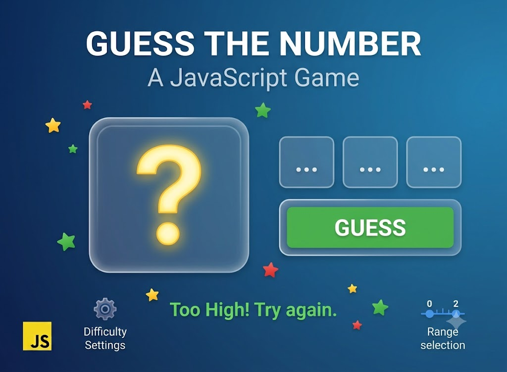

# Guess Number — Lesson Project

Цей проєкт створено на уроках з ментором як навчальна вправа з JavaScript та DOM.

## Що робить проєкт

- генерує випадкове число від 1 до 100;
- дозволяє користувачу вводити здогадки та отримувати зворотний зв’язок;
- показує попередні спроби, підказку «більше» / «менше» та повідомлення про завершення гри;
- після закінчення гри активується кнопка для початку нової партії.

## Використані технології

- HTML для розмітки форми вводу, кнопки та блоків результатів;
- JavaScript для логіки гри, перевірки введених значень та керування станом додатку.

## Навички, які відпрацьовано

- робота з DOM: `querySelector`, `addEventListener`, `classList`, `disabled`, `textContent`, `createElement`, `remove`;
- обробка подій: клік на кнопку та натискання клавіші `Enter` у полі вводу;
- логіка гри: генерація випадкового числа, обмеження кількості спроб, перевірка вгадування;
- взаємодія з користувачем: оновлення підказок, вивід попередніх спроб, управління станом форми;
- робота з формою: отримання значення з поля, очищення поля вводу та встановлення фокусу.

## Структура проєкту

- `index.html` — розмітка інтерфейсу ігрового поля;
- `script.js` — логіка перевірки введених чисел, обробка кожної спроби та перезавантаження гри.

## Контекст створення

Проєкт зроблено в рамках заняття з ментором як завершена навчальна вправа. Він демонструє практичне застосування базових фронтенд-технік без потреби подальшого розвитку.